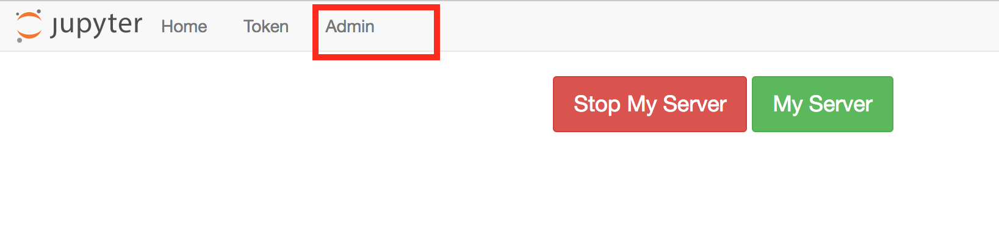

# Fixing Errors

You may run into different types of errors when you are using the JupyterHub or Jupyter notebooks. The majority of errors come from a few common causes and can be solved using the following methods.

## Interact Link Errors

Interact link errors are usually due to one of three issues:

#### 1. The interact link was clicked in an incompatible browser (Microsoft Edge)
Unfortunately, the nbgitpuller software does not support the Microsoft Edge browser. If you click an interact link in Edge, you will likely be taken to your datahub.berkeley.edu dashboard, but you won't see your desired files there. 

Solution: open intereact links in Chrome, Firefox, or Safari

#### 2. The interact link was generated incorrectly
If the interact link was not generated correctly, you'll see a red loading bar with an error message that says "Error: Command '['git', 'fetch']' returned non-zero exit status 128." An example screenshot is below:

Solution: re-generate the interact link. Make sure that you've filled in the correct Jupyter hub URL, Github URL, branch, and file. Some tips:
* URLS should NOT end with forward slashes. "http://github.com/ds-modules" is okay; "http://github.com/ds-modules/" will break
* The Git repository url should go to the base repo that contains the materials you want. For example, if you want to link to the "lab01.ipynb" in the fall19 repository of the data-8 organization, the Git URL should be "https://github.com/data-8/fall19", not "https://github.com/data-8/fall19/blob/master/lab01"
* The File to Open needs to include the full path of the file from the base repository. For example, if the "lab01" file is in a folder called "labs", the File to Open needs to be "labs/lab01"

#### 3. The interact link has been used before, and some of the content was changed in both Datahub and Github
If you make changes to an assignment on Github after students have started working on it, students that click the interact link again may see a red loading bar and a message about a *merge conflict*. This occurs if the instructor and the student both change the same parts of the notebook: nbgitpuller doesn't know how to integrate the instructor's changes without overwriting student work, so it refuses to proceed. You can read [more about nbgitpuller's automatic merging behavior here](https://jupyterhub.github.io/nbgitpuller/topic/automatic-merging.html).

Solution: the easiest and most conservative solution is to rename the file or folder that contains the incompatible changes, then click the interact link again. If the file or folder is renamed to anything else (e.g. "SOC-5-old"), nbgitpuller will clone a fresh copy of the problematic files to the student's Jupyterhub. They can then copy over any work from the old version of the file. 

The best advice, however, is to avoid making changes to assignments once they've been released to students if at all possible.

## Code Cell Errors

This category describes errors that occur when running code cells. This list is not exhaustive, but it details some of the most frequent errors that new Notebook users encounter.

#### NameError
By far the most common errors that new students encounter are NameErrors. NameErrors occur when a code cell refers to a name that has not yet been defined. This usually happens when:
* a student forgets to run a cell, runs cells out of order, or restarts work on another day
* a student misspells a variable name
* a student forgets to put quotation marks around a string (i.e. for text data or the name of a Table column)

Solutions:
* for each discrete notebook work session, run all cells in order (especially the dependencies cell that imports the software). If you pick up work on a different day from when you started it, re-run all the cell above the point where you stopped
* double-check spelling, capitalization, punctuation, and spaces in variable names
* make sure that if you're referring to a string, you enclose it in quotation marks

#### Cells never stop running
Sometimes, cells can get "stuck" running: the square brackets to the left of the cell contain an asterisk for several minutes, the open circle next to kernel type at the top right will stay solid grey, and the expected output never appears. This may happen when:
* the kernel isn't working properly
* the cell contains code that generates an 'infinite loop'- that is, it's executing instructions that don't have any stopping point
* the cell is performing a particularly complex operation. In this case, the cell is not really "stuck"- it will just take several minutes (or more) to finish

Solution:
* try stopping the cell with the square "stop" button at the top toolbar, then attempt to run the cell again
* try restarting the kernel by going to the "Kernel" menu and clicking "Restart". Note: all current variables will be lost and will need to be redefined after the kernel restarts by running the appropriate cells
* check the code to make sure it doesn't execute an infinite loop

## Jupyter Hub Errors
One common error is a Jupyter notebook becoming unresponsive. You will know that a notebook is unresponsive Another type of error is a user not being able to access some part of their JupyterHub account.

We have outlined two methods below that you should try for each error type. For errors related to execution of code, such as the notebook not running properly, you should try restarting the kernel. For errors related to access, you should try restarting the server.

### Restarting the Kernel

If your notebook becomes unresponsive, you can try to restart the kernel.

### Restarting Servers

There are different methods for restarting your own and restarting another user's server.

##### Restarting Your Own Server

All users can restart their own servers. To do so, start by going to the control panel.

Click the `Stop My Server` button.

Once the server has stopped and the `Stop My Server` button is no longer visible, click the `My Server` button to restart the server.

##### Restarting Student Servers

Users with admin privileges on DataHub can restart other users' servers. To restart a student's server, first go to the control panel.

Click on the `Admin` button at the top of the page. If you do not see this button, you do not have admin rights. To request admin rights, please [post on Piazza](http://piazza.com/berkeley/other/cs97).

After clicking the `Admin` button, you will see the admin panel. Usernames have been obfuscated here. To search for a user, you can use find \(type Control+F or Command+F\). An individual's username is the same as their CalNet ID. When you have found the desired user, click the `stop server` button in the user's row.

After clicking the `stop server` button, you can click the `start server` button in the user's row.

