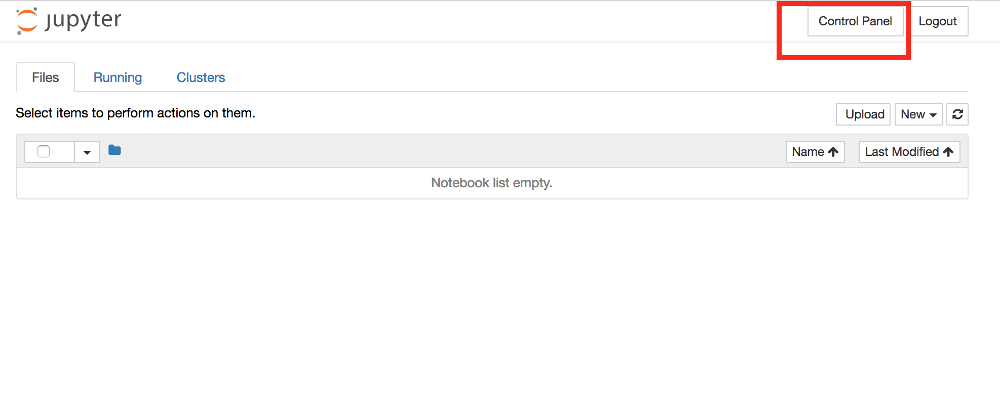
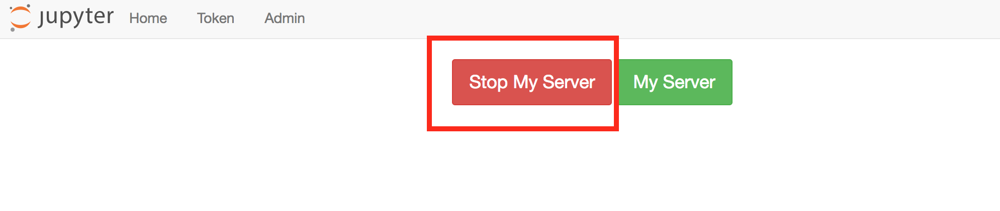
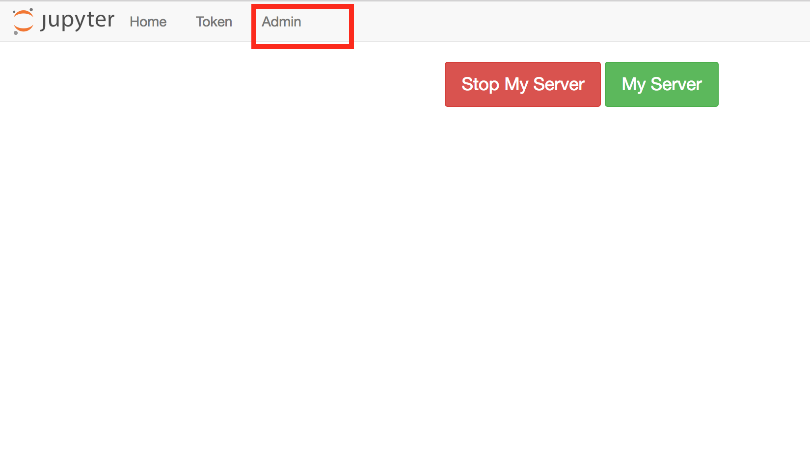

# Troubleshooting issues in the Hub

```{note}
Facing issues with your hub and want to do some basic troubleshooting before escalating issues to us? If yes, read below!
```

One common error is a Jupyter notebook becoming unresponsive. You will know that a notebook is unresponsive. Another type of error is a user not being able to access some part of their JupyterHub account.

We have outlined two methods below that you should try for each error type. For errors related to execution of code, such as the notebook not running properly, you should try restarting the kernel. For errors related to access, you should try restarting the server.

### Restarting the Kernel

If your notebook becomes unresponsive, you can try to restart the kernel.


### Restarting Servers

There are different methods for restarting your own and restarting another user's server.

##### Restarting Your Own Server

All users can restart their own servers. To do so, start by going to the control panel.

Click the `Stop My Server` button.

Once the server has stopped and the `Stop My Server` button is no longer visible, click the `My Server` button to restart the server.


##### Restarting Student Servers

Users with admin privileges on DataHub can restart other users' servers. To restart a student's server, first go to the control panel.


Click on the `Admin` button at the top of the page. If you do not see this button, you do not have admin rights. To request admin rights, please [post on Piazza](http://piazza.com/berkeley/other/cs97).



After clicking the `Admin` button, you will see the admin panel. Usernames have been obfuscated here. To search for a user, you can use find \(type Control+F or Command+F\). An individual's username is the same as their CalNet ID. When you have found the desired user, click the `stop server` button in the user's row.


After clicking the `stop server` button, you can click the `start server` button in the user's row.

#### Troubleshoot issues with Hub/Server/Code running slow

**What should I do if my hub is running slow?**

Try these recommended options,

- Restart your kernel.

- Check whether there are lot of open tabs? If yes, close the tabs that are not required.

If you still face the issue, raise a [bug](https://github.com/berkeley-dsep-infra/datahub/issues/new?assignees=&labels=bug&template=bug_report.yml)!

**What should I do if my code is running slow?**

In general, this issue could be attributed to the varied programming practices adopted that might have slowed the operation of the hub. Check whether your code does any of the following, 

- You are running an infinite loop 
- Your computation/calculation is big 
- You are joining tables that are too large
- You have too many notebooks open at the same time
- You are trying to show a table which is too large and as a result are crashing the browser

If they are relevant, try fixing these issues by improving the programming practices or by reducing the size of the dataset. If none of the highlighted points seem relevant in your scenario, Please raise a [bug request](https://github.com/berkeley-dsep-infra/datahub/issues/new?assignees=&labels=bug&template=bug_report.yml)!

#### Troubleshoot 4xx and 5xx errors

**What should I do if a user's environment is unusable?**

A user's Lab workspace might become unusable (e.g. it opens a notebook or workspace that is impossible to get out of). You have couple of options before you escalate this issue to us:

- Start the user's server by visiting `{hub-url}/user/{username}/lab/workspaces/lab?reset` to reset the workspace.(Refer to this [documentation](https://jupyterlab.readthedocs.io/en/stable/user/urls.html#resetting-a-workspace) to reset the workspace for the users.
- Limit the environment to the user's file browser by visiting `{hub-url}/user/{username}/tree` in Jupyter Notebook.
- Launch a terminal by visiting `{hub-url}/user/{username}/terminals/N` (where `N` is any integer) in Jupyter Notebook. A terminal is useful if one needs to recover from an nbgitpuller issue or run other troubleshooting commands.
- If none of the above options work, Log into the [admin panel](https://datahub.berkeley.edu/hub/admin#/). Search for the calnet id of the user you want to troubleshoot. Click "Edit User" option and cLick on "Delete User" button which results in user getting deleted from the chosen hub. Now, Select the option "back" to go back to admin dashboard. Select "Add Users" option, Add the username (calnet id) and click on the "Add Users" button. Users will be added back to the admin interface. You can either check their instance or ask them to check their instance manually to confirm that the hack worked.

**What if restarting the kernel is not solving spawn pending error message?**

You can check if the output files are causing the ipynb files (in the case of python notebooks) to be bloated. If that be the case then you can run the following command to clear the output files which is causing this issue.

```python
jupyter nbconvert --clear-output --inplace filename.ipynb
```

**What should I do if I get "503 service unavailable error" regularly?**

Sorry, that you had to face this error! This error could be due to some of our stability improvements. Try restarting your server and wait for few minutes to see whether the issue still persists. If yes, raise a github [issue](https://github.com/berkeley-dsep-infra/datahub/issues/new/choose).

**What should I do if I get "403 errors: Blocking request from unknown origin" regularly?**

Sorry, that you had to face this error! This error could be due to multiple reasons outlined below, 

- You are using email id with a different domain other than berkeley.edu to authenticate with Datahub which could have potentially raised this error. Raise a github [issue](https://github.com/berkeley-dsep-infra/datahub/issues/new?assignees=&labels=bug&template=bug_report.yml), so that we can authorize your domain.

- Large number of your students are trying to use the service resulting in failure of certain nodes. We are working on improving how we scale the hub with large volume of users.

Raise a github [issue](https://github.com/berkeley-dsep-infra/datahub/issues/new?assignees=&labels=bug&template=bug_report.yml)!

**What should I do if I get an “An unknown error occurred while loading this notebook” as part of the datahub service?**

Try opening a new terminal from your instance and run the following command, 

```python
rm -f ~/.local/share/jupyter/nbsignatures.db
```

If the error still persists, raise a github [issue](https://github.com/berkeley-dsep-infra/datahub/issues/new?assignees=&labels=bug&template=bug_report.yml).

#### Other hub issues

**What should I do if there is a package conflict?**

[Get inputs from the team]
Try moving to the previous version of the package and check if there are package conflicts. If it still exists, Raise a github [issue](https://github.com/berkeley-dsep-infra/datahub/issues/new?assignees=&labels=bug&template=bug_report.yml)

**What should I do if my kernel dies?**

As a rule of thumb, restart the kernel whenever it dies. This should work for most scenarios.

```{note}
Kernel deaths are a common cause for your server running out of memory. As soon as you exceed your memory allocation, your kernel most probably will die because of the lack of availability of virtual memory or swap space. It is most likely due to a bug in your code.
```

**What should I do if I am getting RStudio Initialization Error: Error occurred during transmission error?**

Please follow this workaround until a fix can be identified and implemented. Workaround involves renaming or removing ~/.rstudio via the terminal. To do so while bypassing the typical rstudio session startup:

1. Go to this [link](https://r.datahub.berkeley.edu/user-redirect/tree)
2. Click New -> Terminal
3. In the terminal, type: ```mv .rstudio .rstudio.$(date +%s)``` and press return
4. Try to launch rstudio as you normally would and it should now work.

**What should I do if R Studio times out and kicks me out every 5 minutes or so?**

- Check if this is a browser or network issue

- If that doesn't solve the issue, raise a request using this [template](https://github.com/berkeley-dsep-infra/datahub/issues/new?assignees=&labels=bug&template=bug_report.yml)

```{note}
As a general note, These issues are challenging to reproduce. It will be helpful if you can be as specific as you can with regards to the steps required to reproduce the issue. We generally observe that the back and forth communication required to reproduce the issue for a request **that is not specific** increases the time needed to fix the issue exponentially.
```

**What should I do if I am not able to view the images annotated in my notebook when I download them as PDF?**

Yes - this is an open issue we are aware of and don't have a direct solution. However, we have raised this issue to the developers of nbconvert which is a package responsible for the notebook to PDF conversion. 
In the short term, the way to circumvent this issue is to copy-paste the required image in the notebook instead of saving them as a relative URL. Saving the image as a relative URL results in the image not getting added to the generated PDF.

```{note}
On Windows and Linux, you can copy/paste by pressing Ctrl + Shift + C / Ctrl + Shift + V. On Mac, you can do it by pressing Cmd + C / Cmd + V.
```

#### nbgitpuller Issues

**What should I do if I have issues with my nbgitpuller set up**

Try the following steps from scratch again,

- Enter the details for your hub.

- Re-name the folder where you need to pull from to do a fresh pull request. 

- Check whether you should have followed good practices for setting up your repo. Check if there are files that should not be present. 

```{note}
Check this [documentation](https://jupyterhub.github.io/nbgitpuller/topic/repo-best-practices.html) for some tips to ensure that you don't get into git related issues. 

Check this [documentation](https://jupyterhub.github.io/nbgitpuller/) if you have issues setting up nbgitpuller!
```

#### Otter Issues

**I am running into issues otter grader in datahub.berkeley.edu. It used to working with the same notebook files previously and I did not make any changes to the notebook. How do I fix this issue?**

An upgrade to otter grader version 4.2.0 was made on 1/10/2022. If otter-grader was running smoothly in your notebooks previously then the updated version might have caused incompatibility with test cases. You can revert to otter version 3.1.0 by running the following command in the short term.

```python
!pip install otter-grader==3.1.4
```

**I am having issues with generating the zip file after running my code in the hub. What should I do?**

If you got this error after running this command mentioned below, this is most likely an issue that the Otter team can debug. You can either access their [slack channel](https://join.slack.com/t/otter-grader/shared_invite/zt-bzfqbl82-C1s~YUBkbzvTcPCK60OOgg) or raise a [github issue](https://github.com/ucbds-infra/otter-grader) to seek their inputs directly.

```python
grader.export(pdf=False, force_save=True)
```

In the long term, you should plan to rewrite your existing test cases to suit the new format and then run the latest version of otter grader in your notebooks. If you need further support with rewriting test cases then please reach out to the otter team [here](https://github.com/ucbds-infra/otter-grader/issues/new?assignees=&labels=question&template=information-request.md&title=).


**What should I do if I have an issue that has not been documented in the FAQ?**

Raise a github [issue](https://github.com/berkeley-dsep-infra/datahub/issues/new/choose) or reach out to Balaji Alwar(balajialwar@berkeley.edu)! We will keep adding common issues to this FAQ document!