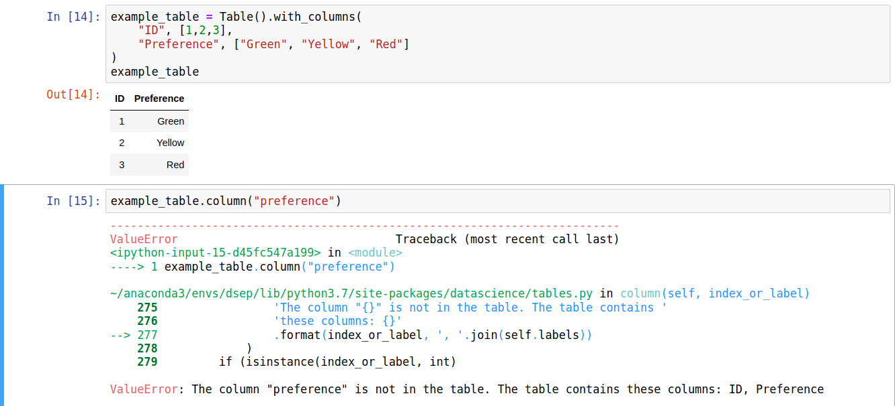
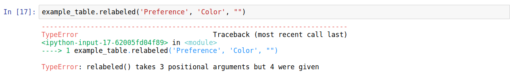
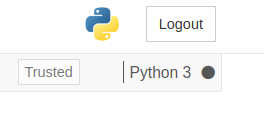

## Code Cell Errors

This category describes errors that occur when running code cells. This list is not exhaustive, but it details some of themost frequent errors that new Notebook users encounter.

#### NameError
By far the most common errors that new students encounter are NameErrors.
An example screenshot is below:
 NameErrors occur when a code cell refers to a name that has not yet been defined. This usually happens when:

* a student forgets to run a cell, runs cells out of order, or restarts work on another day
* a student misspells a variable name
* a student forgets to put quotation marks around a string (i.e. for text data or the name of a Table column)

Solutions:
* for each discrete notebook work session, run all cells in order (especially the dependencies cell that imports the software). If you pick up work on a different day from when you started it, re-run all the cell above the point where you stopped
* double-check spelling, capitalization, punctuation, and spaces in variable names
* make sure that if you're referring to a string, you enclose it in quotation marks

#### ValueError
Common when dealing with table data, ValueErrors arise when misspelled column labels are used.
An example screenshot is below:

Solution:
* The most likely solution is to review the column headers and ensure that the correct value is selected for. Python is case-sensitive, so it's important to check the spelling and capitalization of your strings/variable names.

#### TypeError
When using a function, e.g for table manipulation, it is possible to use the incorrect kind of value. In the example below, the column relabeling function is misused, causing errors in two different ways.

In this error, the function was given too many values:

In this example, the function was given a boolean (in this case, the value True) rather than a string:

Solutions:
* If you see an error relating to the *number* of arguments, check that you are using the correct number. If you aren't sure, refer to prior uses of the function for reference, or ask a friend.
* If you see an error relating to the type, ensure that the values you use in the function call are appropriate. For example, in the case above, renaming the column requires a string, not a boolean.

#### Cells never stop running
Sometimes, cells can get "stuck" running:

When this issue occurs, the square brackets to the left of the cell contain an asterisk for several minutes, the open circle next to kernel type at the top right will stay solid grey, and the expected output never appears. This may happen when:
* the kernel isn't working properly
* the cell contains code that generates an 'infinite loop'- that is, it's executing instructions that don't have any stopping point
* the cell is performing a particularly complex operation. In this case, the cell is not really "stuck"- it will just takeseveral minutes (or more) to finish

Solution:
* try stopping the cell with the square "stop" button at the top toolbar, then attempt to run the cell again
* try restarting the kernel by going to the "Kernel" menu and clicking "Restart". Note: all current variables will be lostand will need to be redefined after the kernel restarts by running the appropriate cells
* check the code to make sure it doesn't execute an infinite loop
